Daily cases
=======================================================================

Daily cases {.tabset}
-----------------------------------------------------------------------

### Cases
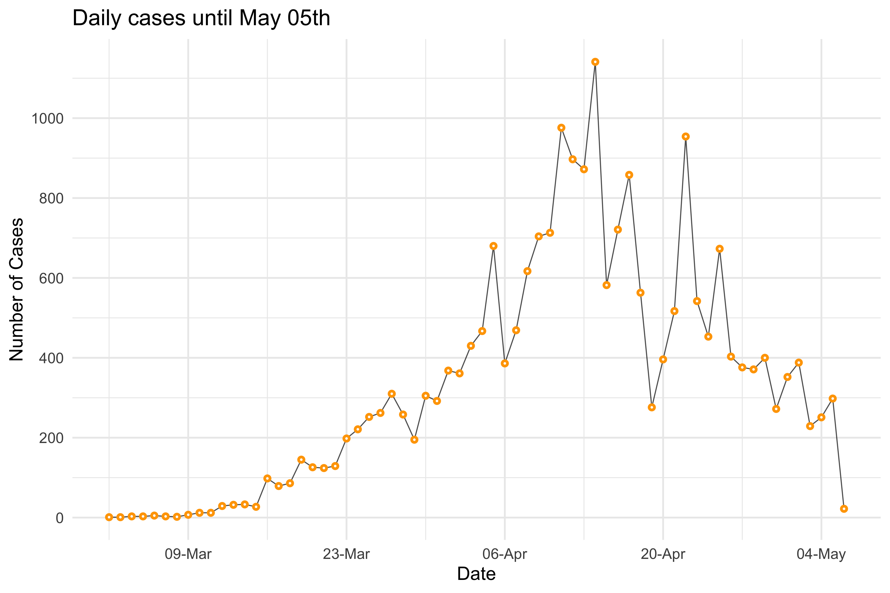

### Deaths
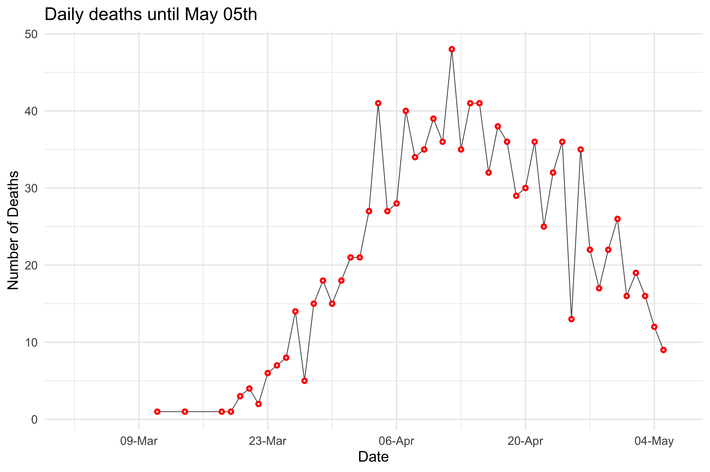

### ICU admissions
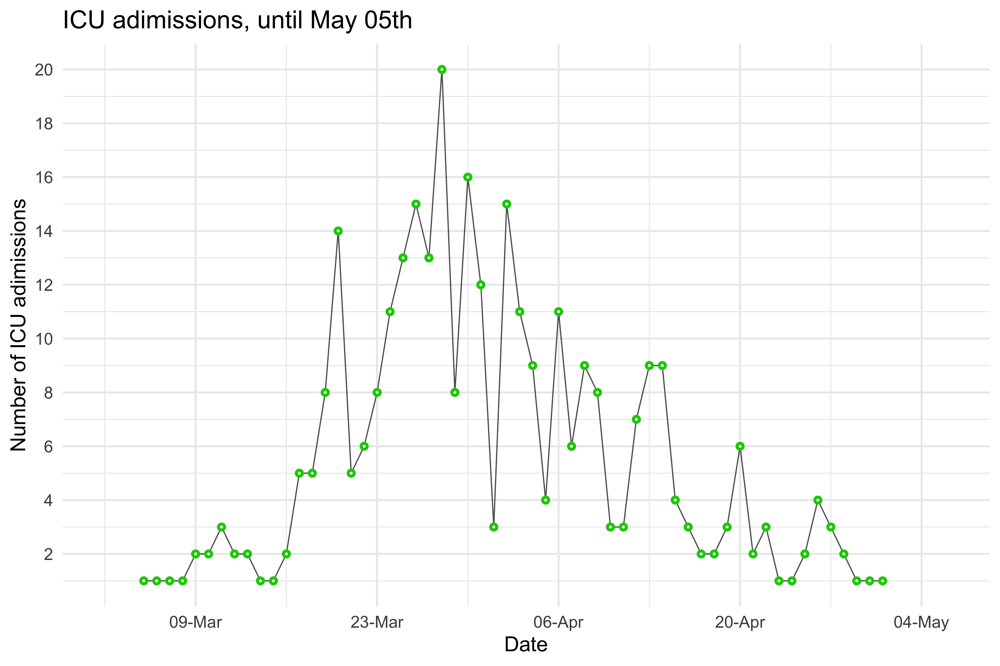

### Hospital Admissions
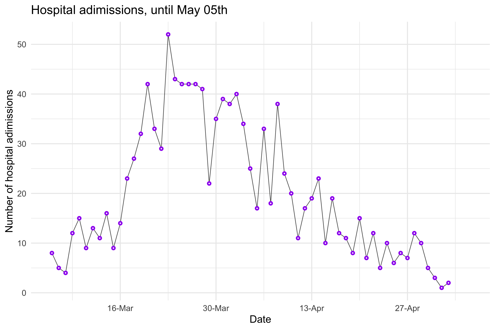

Counties
=======================================================================

Column {.tabset}
-----------------------------------------------------------------------

### Cases

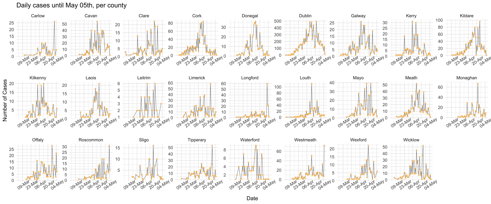

### Deaths

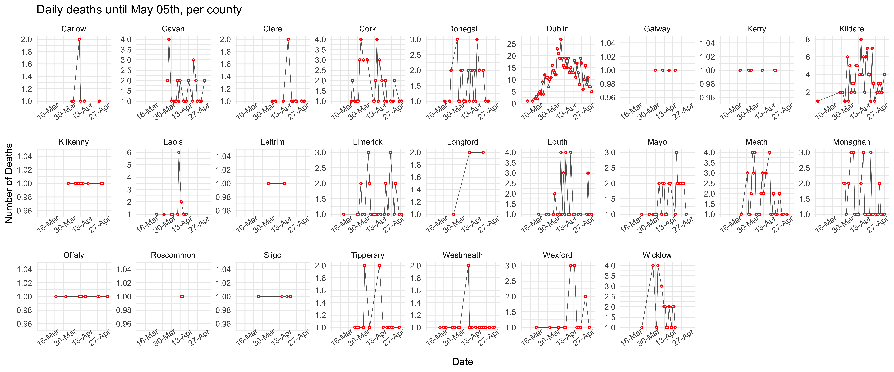

###  ICU admissions
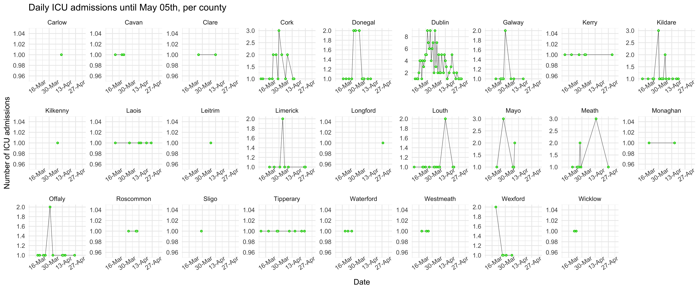

###  Hospital admissions
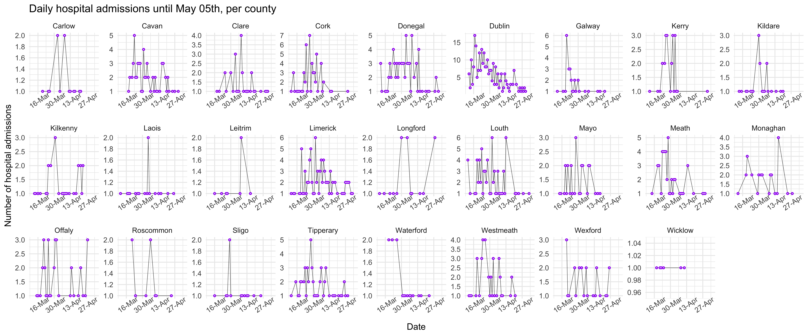

Survival plots
=======================================================================

Survival plots {.tabset}
-----------------------------------------------------------------------

### Survival curve

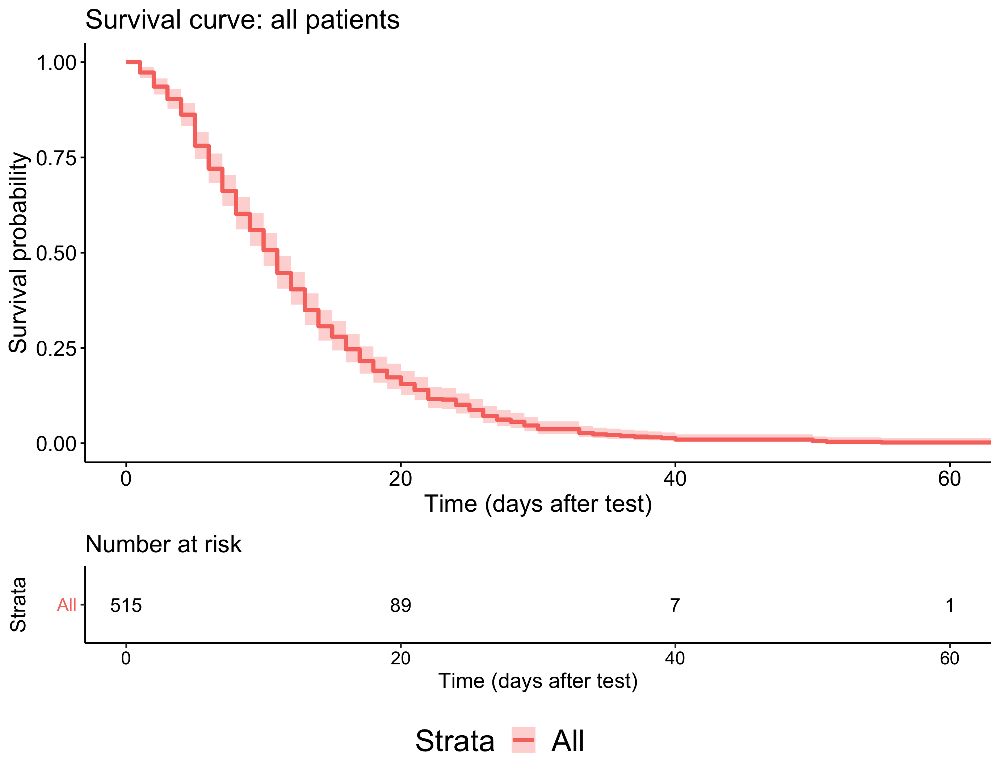

### Age

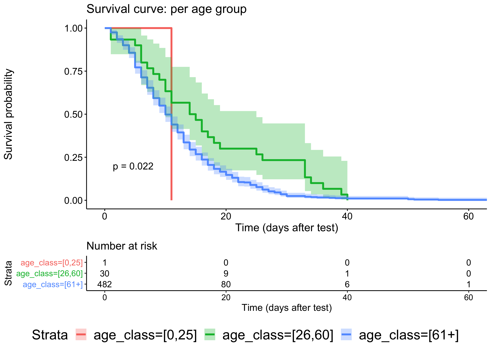

### Sex
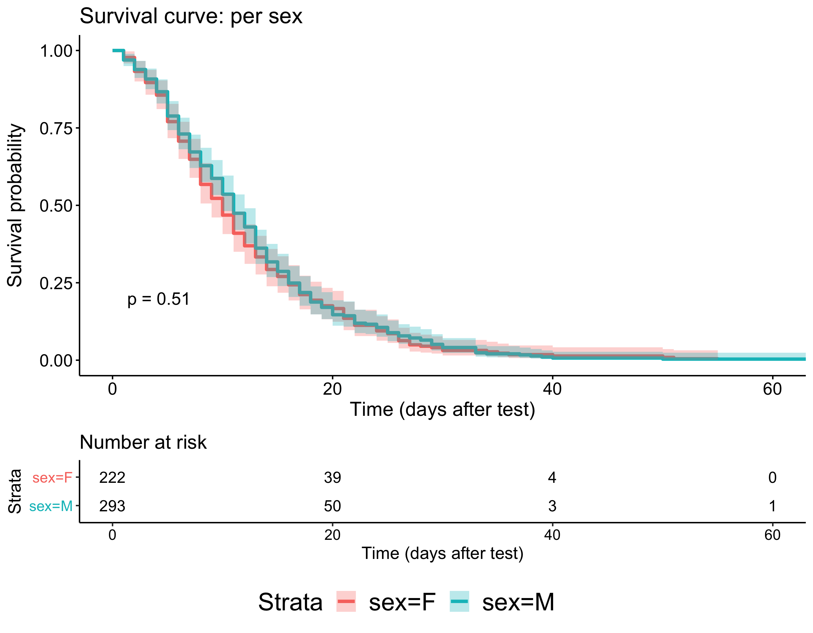

### ICU
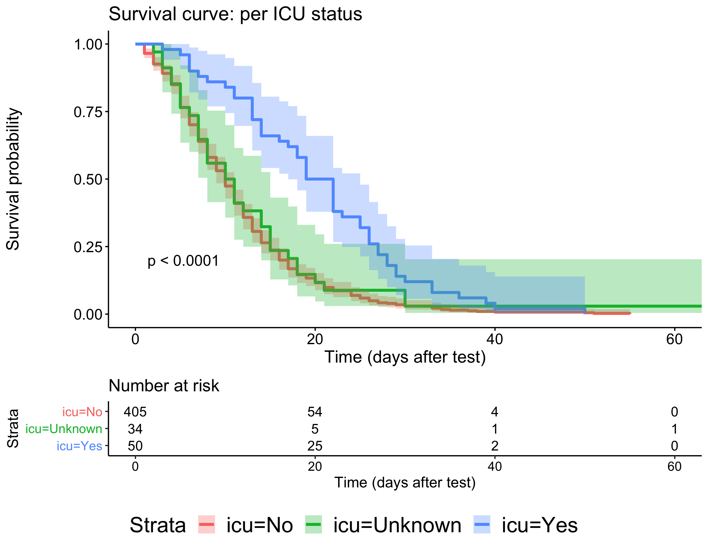

